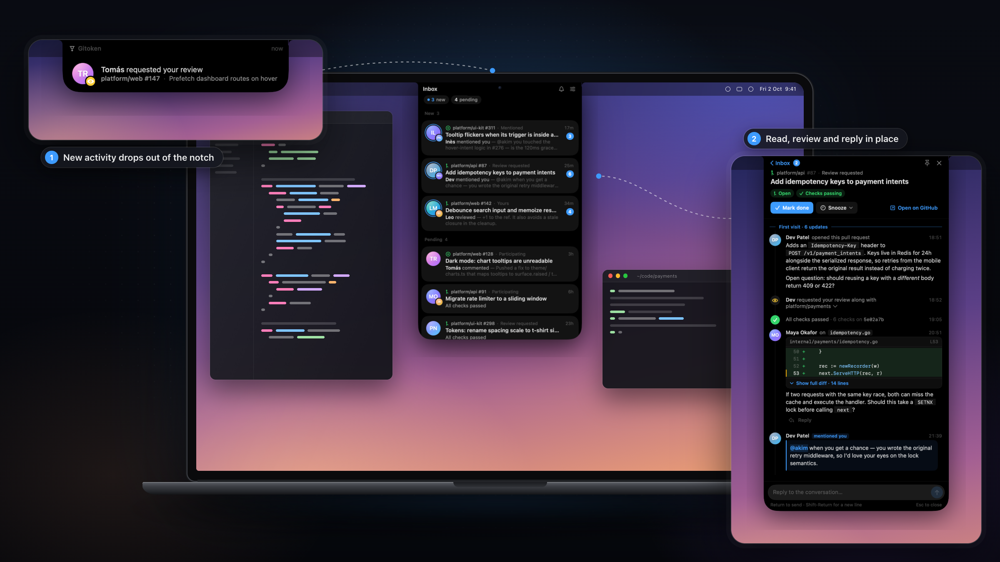

<p align="center">
  
</p>

<h1 align="center">Gitoken</h1>

<p align="center">GitHub notifications that live in your MacBook's notch.</p>

<p align="center">
  
</p>

Gitoken is a macOS menu-bar agent that shows your GitHub notifications around the MacBook notch.

- The collapsed notch shows the number of unseen groups and, while activity arrives, the avatar of whoever caused it. Bursts on the same pull request merge into a single arrival.
- A status-lit rim makes the notch easier to find: blue for unseen activity, violet for quiet/snooze, amber for connection trouble, mint when caught up, and pale blue while starting. A short beam sweeps on launch, status changes and new arrivals; reduced motion keeps only the static rim.
- Setup and Settings use light/dark Gitoken wordmarks; Fluid keeps the dark variant. Empty, caught-up, search-empty, quiet, connection-error and initial-loading states have distinct illustrations. Populated or cached lists stay visible, and the collapsed notch keeps its compact glyph.
- Clicking the notch opens a compact inbox grouped by pull request or issue. Opening a group shows the conversation (timeline, review comments with their diff hunks, check status) in a narrow panel below the notch. Comment bodies render from GitHub's HTML: headings, lists and task lists, tables, highlighted code, collapsible details and images (dark variants on dark surfaces); long bodies fold behind "Show more". New activity arriving while a conversation or the inbox is open is scrolled to, or offered with a "new ↓" pill if you're reading elsewhere.
- Activity timestamps use elapsed time (`2min ago`, `3h ago`) and refresh every minute; conversation and file-preview timestamps retain the full date in their tooltip.
- Escape dismisses transient menus, search or file previews first, then returns to the previous view. Settings returns to its originating conversation or inbox; Escape in the main inbox closes the notch. Clicking outside also collapses it, and reopening restores the prior view, selection and search.
- `/` searches the inbox: words and `"phrases"` match titles, repositories, `#numbers`, previews and people; qualifiers `repo:`, `author:`, `reason:` (e.g. `reason:review`, `reason:mention`) and `is:unread` / `is:read` / `is:pr` / `is:issue` narrow it, `-` excludes. Esc clears the search, ↓ or Return jumps to the first result.
- Custom sections show saved GitHub searches above the notification inbox, including matching PRs and issues that have no notification. Sections are browse-only: no extra arrivals, sounds or global badge counts.
- Review comments open a floating file preview above the notch window: beside it when there is room, centered over its expanded content otherwise. The file's PR diff or whole file is highlighted, with every review thread inline under its line (reply, resolve, open on GitHub at that line). Outdated comments show the file at their original commit. Space toggles it from the inbox or a conversation and it follows the selection; J/K (or ↑/↓) jump between threads, D/F switch Diff/File, R replies, ⌘F finds, Esc dismisses it and restores the originating notch view. Clicking the preview does not collapse the notch. Pin keeps a copy open. File contents and diffs are fetched only from GitHub; Gitoken does not scan local clones, create worktrees, check out branches or map files into an editor. TypeScript, TSX, JavaScript, C#, JSON, YAML, Markdown, HTML, CSS and SCSS are highlighted with tree-sitter, other languages with a simpler keyword highlighter. Lockfiles, minified or generated files and files over 1 MB stay collapsed until loaded.
- Review mode: the preview lists the pull request's changed files beside the code (on by default for review requests, B toggles it, N/P move between files; the conversation's Files button opens it). Click a line number, or drag across several, to comment on that line or range: Return adds the comment to your pending review (kept on GitHub, like github.com), ⌘Return posts it on its own. Pending comments can be deleted; the Review button submits the pending review as Comment, Approve or Request changes with an optional summary, or discards it. ```` ```suggestion ```` blocks can be added to a batch and committed together as one commit on the head branch.
- Reviews by AI reviewers (Copilot, CodeRabbit, …) can be shown, collapsed to one line, or hidden. Unless "Notify for AI reviews" is on, AI-only activity never triggers an arrival or sound and doesn't change inbox previews.
- Seen is not done. Opening a group marks it seen (read on GitHub); marking it done removes it from the inbox (done on GitHub). Seen-but-not-done groups stay listed as pending. New activity on a done group brings it back.
- Quiet hours, manual quiet and snooze (per group or app-wide: 30 minutes, 1 hour, until tomorrow 09:00) suppress arrival animations while activity keeps collecting; a summary arrival appears when quiet ends.
- A subtle sound (Drop, Chime or Tap; or Off) plays once per new arrival. Bursts stay a single sound, and quiet mode, quiet hours, snooze and full-screen spaces keep it silent.
- Settings has three tabs: **General** for image-based Calm/Fluid presets, motion, display, keyboard, saved replies and launch at login; **Notifications** for notification types, sound, AI reviews, focus and mute rules; **Sections** for saved GitHub searches. The presets are the only appearance selector; motion remains independently configurable. Type switches cover review requests, mentions, team mentions, your threads, comments, assignments, state changes, following and CI activity. Disabled types disappear immediately from the inbox, badge, arrivals, sounds and summaries but remain tracked locally; GitHub read/done state is unchanged. Re-enabling a type restores tracked groups without replaying old arrivals.
- PR Shelf has been removed, including its floating circle, separate polling and settings. Existing databases migrate automatically, preserving inbox data and dropping retired shelf tables.

On Macs without a notch, Gitoken shows a pill at the top of the main screen. It hides while a full-screen space is active.

## Custom sections

Open **Settings → Sections**, or the stacked-plus button in the inbox. Give a section a name and GitHub search query, preview the results, then save. Edit or delete sections in Settings, use the up/down buttons to reorder them, and click a section header to collapse it. Names, queries, order and collapse state persist.

Queries use GitHub search syntax, including qualifiers, quoted text, grouped `AND`/`OR` clauses and `sort:`. For example:

```text
repo:cli/cli is:pr archived:false sort:updated-desc (author:mislav OR author:vilmibm)
```

- A PR or issue appears in every matching section. Seen, dismissal and last-visit state are shared across those sections, separately for each GitHub account. Section definitions are global; cached results and subject state are account-scoped.
- Newly encountered subjects in a section's initial baseline start seen; adding or editing a section preserves existing local unseen state. Later new or updated subjects get a local unseen indicator, not a notch badge or arrival. Opening a result marks it seen locally. `D`/`E` dismiss it from all matching sections; `U` undoes the dismissal. New activity brings it back, and each section offers **Restore dismissed**.
- Results open a read-only native conversation with the recent timeline, review comments and checks. Use **Open on GitHub** for replies, reviews and the complete history. Search subjects have no notification-thread identity: browsing or dismissing them never marks a GitHub notification read or done.
- Sections refresh when the inbox is visible, at most once every five minutes automatically; each has a manual refresh button. Cached rows stay visible after a failed refresh. Load more fetches 100 results at a time, up to GitHub's 1,000-result search limit. Incomplete results and capped totals are shown explicitly; narrow the query to retrieve matches beyond that limit.
- The inbox's `/` search also filters loaded section rows. Search subjects have no notification `reason:`, so a positive reason filter excludes them.

## Requirements

- macOS 15 Sequoia or later. Liquid Glass styling is used on macOS 26; macOS 15 gets the system materials.
- The GitHub CLI, installed and signed in to github.com. Gitoken reuses its token (`gh auth token`) and has no login of its own:

  ```sh
  brew install gh
  gh auth login
  ```

  If gh is missing, signed out or its token is rejected during startup, Gitoken automatically opens setup guidance with copyable Terminal commands and a Retry button. Run `brew install gh` if needed, then `gh auth login`, and click Retry. Gitoken does not execute installation or login commands itself. Dismissing the guidance keeps it closed for the remainder of that launch; already-authenticated users start with the notch collapsed.

## Install

```sh
brew install --cask benzara-tahar/tap/gitoken
```

Release zips are also attached to each [GitHub Release](https://github.com/benzara-tahar/gitoken/releases).

### First launch

Gitoken is ad-hoc signed and not notarized, so Gatekeeper blocks the first launch. Either:

- open System Settings › Privacy & Security and click **Open Anyway** next to the Gitoken message, then launch it again, or
- clear the quarantine flag:

  ```sh
  xattr -dr com.apple.quarantine /Applications/Gitoken.app
  ```

Gitoken has no Dock icon. Launch at login is off by default and can be enabled in its settings.

## Building from source

Requires Xcode 26. Commands below use `DEVELOPER_DIR` to pick Xcode without changing the global `xcode-select` setting:

```sh
export DEVELOPER_DIR=/Applications/Xcode.app/Contents/Developer

# Core logic tests (Swift Testing)
(cd Packages/GitokenCore && swift test)

# App
xcodebuild -project Gitoken.xcodeproj -scheme Gitoken -configuration Debug \
  -derivedDataPath build/DerivedData build
open build/DerivedData/Build/Products/Debug/Gitoken.app
```

`scripts/select-xcode.sh` prints the `export DEVELOPER_DIR=…` line for the newest Xcode 26 in `/Applications`.

To produce a distributable zip (universal Release build, ad-hoc signed, zipped with `ditto`):

```sh
scripts/package.sh 1.2.3   # -> dist/Gitoken-1.2.3.zip and its sha256
```

### Artwork

The nine original PNGs remain in `assets/`. Native resources are in `App/Resources/Assets.xcassets`: `GitokenLogo` selects its light/dark wordmark by luminosity appearance, and the six `Inbox…` imagesets supply decorative state artwork. Wordmarks have 160/320-pixel widths; illustrations have 96/192-pixel canvases for 1×/2× rendering, preserving original colors, transparency and shadows.

`AppIcon` supplies all ten macOS icon slots, from 16 points at 1× through 512 points at 2×. Xcode builds the application icon from the catalog in Debug and Release; the app remains a menu-bar agent rather than adding a Dock presence.

### Sounds

The arrival sounds in `App/Resources/Sounds/` are synthesized by `scripts/generate-sounds.swift` (no third-party audio). The script is deterministic, so rerunning it reproduces the committed files byte for byte; it prints each file's duration, peak and RMS level:

```sh
swift scripts/generate-sounds.swift
afinfo App/Resources/Sounds/Drop.caf
```

### Debug builds

- `--fixtures` launch argument: runs against built-in fictional notifications and an in-memory database instead of GitHub. No gh login needed.

  ```sh
  open build/DerivedData/Build/Products/Debug/Gitoken.app --args --fixtures
  ```

  Fixture search includes notification subjects and a permanently search-only draft, `platform/web#151`. It supports text, grouped Boolean clauses and `repo:`, `org:`, `user:`, `author:`, `is:`, `state:`, `draft:` and `archived:` predicates, with created/updated/comments sorting. Unsupported fixture predicates or sorts return an explicit error; live searches are evaluated by GitHub.

- Hidden debug controls: open the notch, then Settings › General. A Debug section at the bottom advances the app clock by 30 minutes, 1 hour or 1 day (to check snooze expiry and quiet hours) and, with `--fixtures`, simulates a new notification, a burst on one pull request, or activity on a done group.
- The same actions are on a right-click menu on the collapsed notch, so you can fire a burst while an arrival banner is still showing and watch it merge.

Neither exists in Release builds.

## Architecture

```
App/                      SwiftUI views hosted in AppKit NSPanels (main-actor UI only)
  Preview/                File preview window: TextKit 2 code view, inline thread cards, file list, review tools
Packages/GitokenCore/     All non-UI logic, tested with `swift test`
  GitHub/                 gh token lookup, REST + GraphQL client (URLSession + Codable)
  Inbox/                  @Observable InboxStore + CustomSectionStore, grouping, local subject state, settings
  Model/                  Domain types
  Preview/                Review threads, GitHub file/diff loading, diff parsing, tree-sitter highlighting
  Time/                   Injectable clock (NowProvider)
```

Data flow:

1. Token: `gh auth token`, run from the usual gh install locations because GUI apps do not inherit the shell `PATH`.
2. Poll: a single task polls `GET /notifications?all=true` with `If-Modified-Since`, honouring `X-Poll-Interval` (never faster than 60 s). Polling pauses on sleep and screen lock and runs immediately on wake.
3. Hydrate: only threads that changed, or that the user opens, are fetched through GraphQL (timeline, review comments, check rollup).
4. Persist: notification/search state and caches are stored in SQLite through GRDB with explicit migrations, keyed by account (host, login). Settings, including saved section definitions, are global.
5. Present: the `@MainActor @Observable` `InboxStore` derives groups, unseen and pending counts and arrivals; the SwiftUI views in the notch panel observe it.
6. Search: visible-inbox refreshes query `GET /search/issues` sequentially; opening a search subject hydrates GraphQL by repository and subject number without a notification thread ID.

Notification sync is two-way: seen maps to GitHub "read" (`PATCH /notifications/threads/{id}`), done maps to GitHub "done" (`DELETE /notifications/threads/{id}`). Threads missing from a full listing were marked done elsewhere and become done locally. Snooze and custom-section seen/dismissed state are local only.

The notch UI is a borderless, non-activating panel above the menu bar, resized to its content. It takes keyboard focus while open, unless a file-preview panel is key. Preview panels sit one window level above it and return focus and navigation to the originating notch view when dismissed.

The inbox renders notification and custom-section rows through the outer `LazyVStack`; custom sections use `Section`, not an eager stack around all their rows. `Buckets` is an immutable reference snapshot so SwiftUI does not recursively compare full group payloads captured by view closures. Content-height tracking is capped at the available viewport height, avoiding whole-list updates when lazy off-screen height estimates change.

## Releasing

Push a tag `v<version>`:

```sh
git tag v1.2.3
git push origin v1.2.3
```

`.github/workflows/release.yml` then runs the tests, builds and signs `Gitoken-1.2.3.zip` with `scripts/package.sh`, creates the GitHub Release with the zip attached, and updates `Casks/gitoken.rb` in `benzara-tahar/homebrew-tap` from `packaging/homebrew/gitoken.rb.template`. The tap update needs a `TAP_GITHUB_TOKEN` repository secret with write access to the tap; without it the step is skipped with a notice. Tags with a prerelease suffix (`v1.2.3-beta.1`) create a GitHub prerelease and leave the tap alone.

CI (`.github/workflows/ci.yml`) runs the core tests and a Release build of the app on every push and pull request to `main`.

## Prototypes

`index.html` at the repository root links the interactive HTML prototypes that preceded the app (`opus-5.5/`, `fable-5/`, `fable-5.1/`). `opus-5.5/` is the design reference for the native app.
